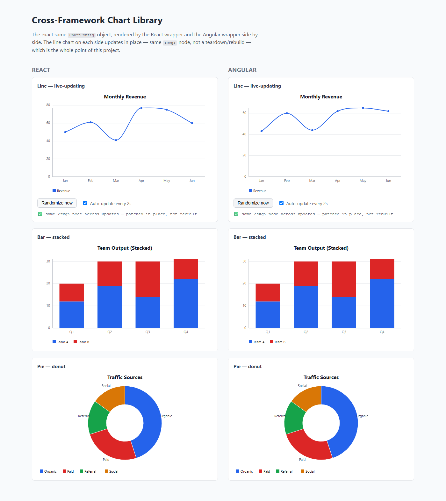

# SulaCharts

A lightweight, framework-agnostic SVG charting engine with genuinely idiomatic React and Angular bindings — built as a portfolio piece to demonstrate architecture, not to compete with Highcharts or ECharts on feature breadth.

**The pitch:** most chart libraries treat their framework wrappers as an afterthought bolted onto a vanilla-JS core, so behavior diverges between frameworks — React wrappers that tear down and rebuild the whole chart on every data update, Angular wrappers that fight zone.js's change detection or leak listeners on destroy. This one's core engine (scale/axis math, SVG rendering, animation, an event system) has zero knowledge that React or Angular exist. Both wrappers are a few dozen lines of lifecycle glue: mount once, call `update()` on data changes, call `destroy()` on unmount. `update()` patches the existing DOM in place — same `<svg>` node, same `<path>` elements — instead of rebuilding, which is the actual differentiator, not just a claim in this paragraph. See it proven live in the [demo](#demo) below.

Read the [case study](docs/CASE_STUDY.md) for the full story, including two real bugs that only surfaced once the demo was actually run in a browser rather than trusted to typecheck-and-build.

## Demo

React and Angular, rendering from the *same* config-construction code, side by side. The green line under each line chart is read from the live DOM, not hardcoded — it's comparing the actual `<svg>` node before and after a data update.



Run it yourself:

```
pnpm install
pnpm --filter demo dev
```

## Architecture

```
packages/core     framework-agnostic engine — scales, axes, SVG rendering, animation, event system
packages/react    thin wrapper — mount/update/destroy + on/off mapped to props
packages/angular  thin wrapper — same lifecycle, plus zone.js-aware event handling
apps/demo         both wrappers, side by side, live-updating
```

The core exposes a small imperative API — `new Chart(container, config)`, `chart.update(partialConfig)`, `chart.destroy()`, `chart.on(event, handler)` / `chart.off(...)` — and nothing else framework-specific leaks through it. Every wrapper decision (React's `useEffect` lifecycle, Angular's `ngZone.runOutsideAngular`) exists entirely inside the wrapper package; the core doesn't know either exists.

`update()` is a partial merge, not a full replace — it diffs the merged config against the current one and only rebuilds the DOM from scratch when something structural changed (series added/removed/reordered, chart type changed). A data-only update, a color change, or a container resize all patch the existing nodes in place.

Supports line, bar (grouped or stacked), and pie/donut charts, plus color/axis/tooltip/legend/title/animation config, and `ResizeObserver`-based responsive sizing — implemented once in the core engine, so both wrappers get it for free.

## Status

The original 7-day build (Day 0–7) is done — see [PROGRESS.md](PROGRESS.md) for the full day-by-day log, including every gap that got found and fixed along the way rather than glossed over. [chart-library-project-brief.md](chart-library-project-brief.md) has the original scope and architecture decisions.

**Still open**: where the [case study](docs/CASE_STUDY.md) gets published (this README, a separate blog post, or an Upwork profile).

## Packages

| Package | | |
|---|---|---|
| [`@sulacharts/core`](packages/core) | the rendering engine | [README](packages/core/README.md) |
| [`@sulacharts/react`](packages/react) | React wrapper | [README](packages/react/README.md) |
| [`@sulacharts/angular`](packages/angular) | Angular wrapper — held back, see its README | [README](packages/angular/README.md) |

Not published to npm yet — `core` and `react` are ready to be; `angular` is deliberately held back until it's built with `ng-packagr` instead of tsup (see its README for why). Until published, consume all three via the pnpm workspace (`workspace:*`), as the demo app does.

## Local development

```
pnpm install
pnpm build       # builds core, react, angular
pnpm test        # 81 tests across all three packages
pnpm lint
```

Each package also has its own `dev`/`test`/`typecheck` scripts — see `pnpm --filter <package> run <script>`.

## License

MIT — see [LICENSE](LICENSE).
